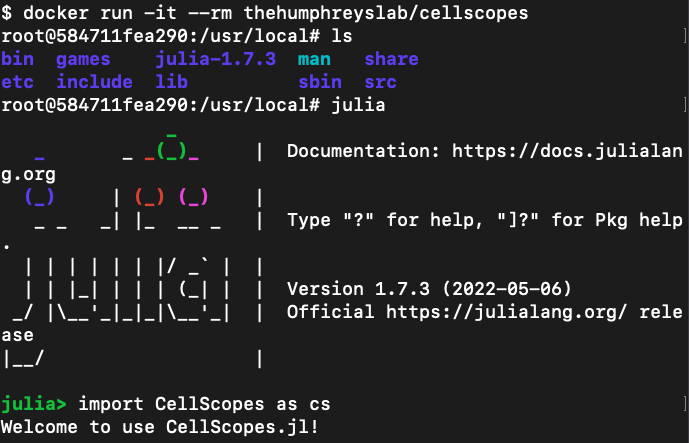

# CellScopes Docker Installation notes
Updated: March 4th, 2024\
OS_1: 22.04.1-Ubuntu x86_64\
OS_2: macOS Monterey 12.7.3\
Julia Version: 1.7.4\
CellScopes Version: CellScopes.jl v1.0.0\
Contact: Dian Li

- [CellScopes Docker Installation notes](#cellscopes-docker-installation-notes)
  - [Part 0. Introduction](#part-0-introduction)
  - [Part 1. Install Docker on Ubuntu (OS\_1)](#part-1-install-docker-on-ubuntu-os_1)
  - [Part 2. Pull CellScopes Docker Image](#part-2-pull-cellscopes-docker-image)
  - [Part 3. Run CellScopes in Docker](#part-3-run-cellscopes-in-docker)
    - [Option 1. Directly load CellScopes in OS\_1](#option-1-directly-load-cellscopes-in-os_1)
    - [Option 2. Directly load CellScopes in OS\_1 and mount a volume for data access](#option-2-directly-load-cellscopes-in-os_1-and-mount-a-volume-for-data-access)
    - [Option 3. Remotely load CellScopes in OS\_1 via Jupyter Notebook from OS\_2](#option-3-remotely-load-cellscopes-in-os_1-via-jupyter-notebook-from-os_2)

## Part 0. Introduction

<span style="color:red">*WARNING: sudo required* </span>

- The Docker installation in this notes was tested on both Mac and Ubuntu operating systems.
- Sudo access is necessary.
- OS_1 (remote) serves as the host for the [CellScopes Docker image](https://hub.docker.com/r/thehumphreyslab/cellscopes).
- While OS_2 (optional and potentially the same as OS_1) is utilized for accessing [CellScopes](https://github.com/HaojiaWu/CellScopes.jl) through Jupyter Notebook.

## Part 1. Install Docker on Ubuntu (OS_1)

- Please refer to the Docker website at: https://docs.docker.com/engine/install/ubuntu/

## Part 2. Pull CellScopes Docker Image

- The CellScopes docker image can be found at: https://hub.docker.com/r/thehumphreyslab/cellscopes

- To pull the image

```
sudo docker pull thehumphreyslab/cellscopes
```

## Part 3. Run CellScopes in Docker

### Option 1. Directly load CellScopes in OS_1

To begin with, CellScopes can be directly loaded within the Docker container:

```
$ docker run -it --rm thehumphreyslab/cellscopes
```

Inside the container, enter julia interactive mode by typing 'julia':
```
root@xxxxxxx:/usr/local# julia
```

Inside julia interactive mode, import CellScopes by:
```
julia> import CellScopes as cs
```

Here is a snapshot for the operations mentioned above




### Option 2. Directly load CellScopes in OS_1 and mount a volume for data access

To connect a directory on OS_1 with the Docker container, we can:

```
sudo docker run -it \
--rm \
-v /Dir_To_Mount:/usr/local/data \
thehumphreyslab/cellscopes
```

The data stored on OS_1 could be accessed via */usr/local/data/* inside the container.

The rest of the procedures are the same as in Option 1.

Here is a snapshot for the operations mentioned above


### Option 3. Remotely load CellScopes in OS_1 via Jupyter Notebook from OS_2

In some cases, we might need to access the CellScopes Docker container remotely from a second machine OS_2.


