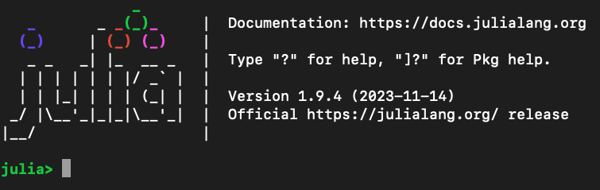
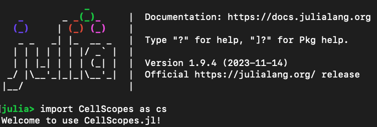

# Installation notes
Updated: November 30th, 2023

## Part 1. Install Julia Language

### Step 1.0. Preparation

On Linux server, assume your user name is doe, and your login directory is at **/home/user/doe/**. We will use this directory to download and install Julia for demonstration purposes.  

```
cd /home/users/doe/
```
If you would like to completely remove an old Julia installation:

```
rm -rf julia/
rm -rf .julia/
```


### Step 1.1. Download Julia 1.9.4 for Linux x86
Previous versions of Julia can be found at: https://julialang.org/downloads/

We will download Julia 1.9.4 released on November 14th, 2023

```
wget https://julialang-s3.julialang.org/bin/linux/x64/1.9/julia-1.9.4-linux-x86_64.tar.gz
tar xvf julia-1.9.4-linux-x86_64.tar.gz
```

To test whether your download is successful, use this command to enter a Julia interactive session

```
julia-1.9.4/bin/julia
```

If this works, you would see a welcome message from Julia!




### Step 1.2. Add Julia to PATH

Assume you have a **~/.bashrc** file, then append the following code to the end of the **~/.bashrc** file.

```
export PATH=/home/users/doe/julia-1.9.4/bin:$PATH
```
<span style="color:red">WARNING: Remember to replace the **/home/users/doe** part by the **actual path** where you just installed Julia.</span>.

<span style="color:red">WARNING: Also make sure that paths for **older Julia installations** should be **removed** from the .bashrc file.</span>.

### Step 1.3. Reload .bashrc

To implement your changes, either open a new login session, or reload the .bashrc via

```
source ~/.bashrc
```

## Part 2. Install CellScopes for Julia v1.9

First enter Julia by typying 

```
julia
```

Within Julia interactive session, first install Leiden.jl followed by CellScopes.jl#julia_v1_9.

```
using Pkg
Pkg.add(url="https://github.com/bicycle1885/Leiden.jl")
Pkg.add(url="https://github.com/HaojiaWu/CellScopes.jl#julia_v1_9")
```
To test whether CellScopes has been installed successfully:

```
import CellScopes as cs
```

If the installation succeeded, you would see a welcome message from CellScopes!




### Misc

Testing Linux version info:

```
DISTRIB_ID=Ubuntu
DISTRIB_RELEASE=20.04
DISTRIB_CODENAME=focal
DISTRIB_DESCRIPTION="Ubuntu 20.04.2 LTS"
```